::: titlepage
::: center
Санкт-Петербургский политехнический университет\
Петра Великого\
:::

::: center
Физико-механический иститут
:::

::: center
Кафедра «Прикладная математика»
:::

::: center
**Отчёт по лабораторной работе №1\
по дисциплине «Анализ данных с интервальной неопределённостью»**
:::

::: flushleft
Выполнил студент:\
Аникин Александр Алексеевич\
группа: 5040102/20201

Проверил:\
к.ф.-м.н., доцент\
Баженов Александр Николаевич
:::

::: center
Санкт-Петербург\
2023 г.
:::
:::

# Постановка задачи

Имеется две вещественные выборки $\overline{X_{1}}, \overline{X_{2}}$.
Необходимо построить из них две интервальные выборки $X_{1}, X_{2}$ и
найти такой вещественный коэффициент $R$, что выборка
$X_{1} \cup R X_{2}$ будет наиболее совместной в смысле индекса Жаккара.

# Теория

## Индекс Жаккара

Индекс Жаккара определяет степень совместности двух интервалов $x, y$.
[]{#e:simplejaccard label="e:simplejaccard"}
$$JK(x, y) = \frac{wid(x \land y)}{wid(x \lor y)}$$

Здесь $\land, \lor$ представляют собой операции взятия минимума и
максимума по включению в полной арифметике Каухера. Формула
[\[e:simplejaccard\]](#e:simplejaccard){reference-type="ref"
reference="e:simplejaccard"} легко может быть обобщена на случай
интервальной выборки $X = \{x_i\}_{i=1}^{n}$.

$$JK(X) = \frac{wid(\land_{i=1,n}x_i)}{wid(\lor_{i=1,n}x_i)}$$
[]{#e:jaccard label="e:jaccard"}

Видно, что $JK(X) \in [-1, 1]$. Для удобства перенормируем значение
$JK(X)$ так, чтобы оно было в интервале $[0, 1]$.

$$JK(X) = \frac{1}{2} + \frac{1}{2} JK(X)$$

## Нахождение оптимального значения R

Для нахождения оптимального $R$ необходимо сначала найти верхнюю и
нижнюю границы $\underline{R}, \overline{R}$.

[]{#e:outerRMin label="e:outerRMin"}
$$\underline{R} = \frac{\min_{i=1,n}\underline{x_{1i}}}{\max_{i=1,n}\overline{x_{2i}}}$$
[]{#e:outerRMax label="e:outerRMax"}
$$\overline{R} = \frac{\max_{i=1,n}\overline{x_{1i}}}{\min_{i=1,n}\underline{x_{2i}}}$$

Затем оптимальное значение $R$ может быть найдено методом половинного
деления.

# Результаты

Данные были взяты из файлов *data/dataset1/+0_5V/+0_5V_0.txt* и
*data/dataset/-0_5V/-0_5V_42.txt*. Обынтерваливание было произведено
следующим образом.
$$\textbf{x}_i = [(x_i - \delta_i) - \varepsilon, (x_i - \delta_i) + \varepsilon], \varepsilon = \frac{1}{2^{14}}$$
где $x_i$ - точечное значение, $\delta_i$ - точечная погрешность. Набор
$\delta_i$ получен из соответствующих файлов в
*data/dataset1/ZeroLine.txt*

Для начала рассмотрим исходные данные с учётом и без учёта $\delta_i$.

<figure id="p:rawSampleX1">

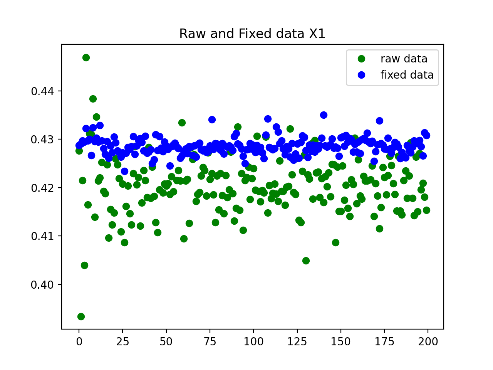

<figcaption>Исходные данные выборка <em>X</em>1</figcaption>
</figure>

Гистограмма распеределения $\delta_i$ для $X_1$ имеет вид.

<figure id="p:deltasHistX1">

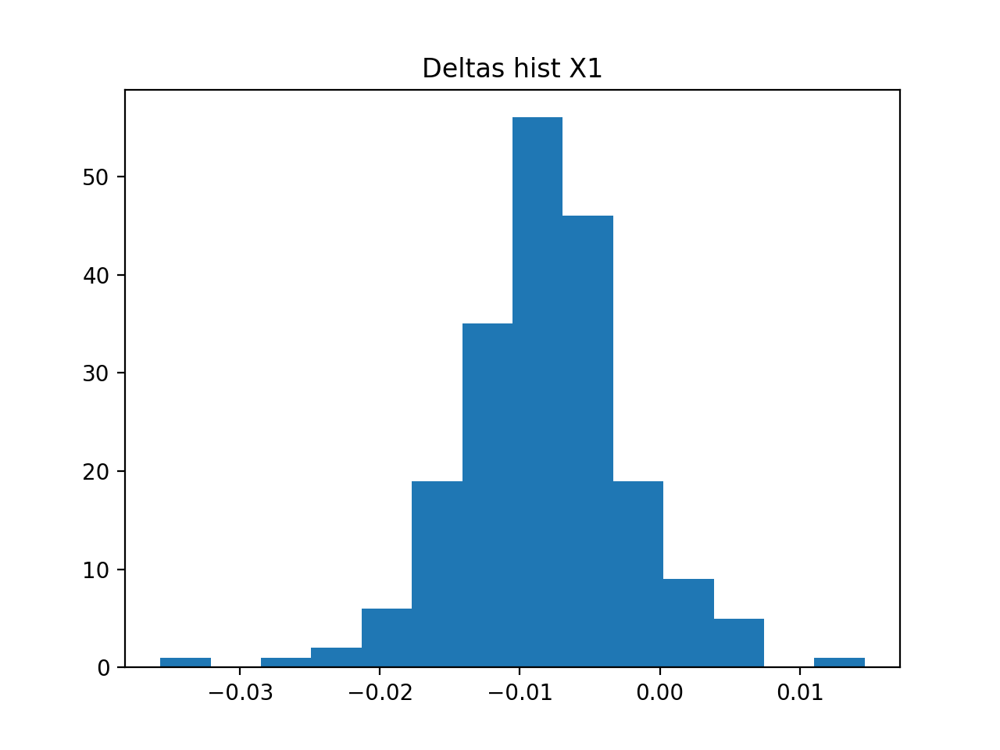

<figcaption>Гистограмма распределения <em>δ</em><em>i</em> для <em>X</em>1</figcaption>
</figure>

Тоже самое для $X_2$

<figure id="p:rawSampleX2">

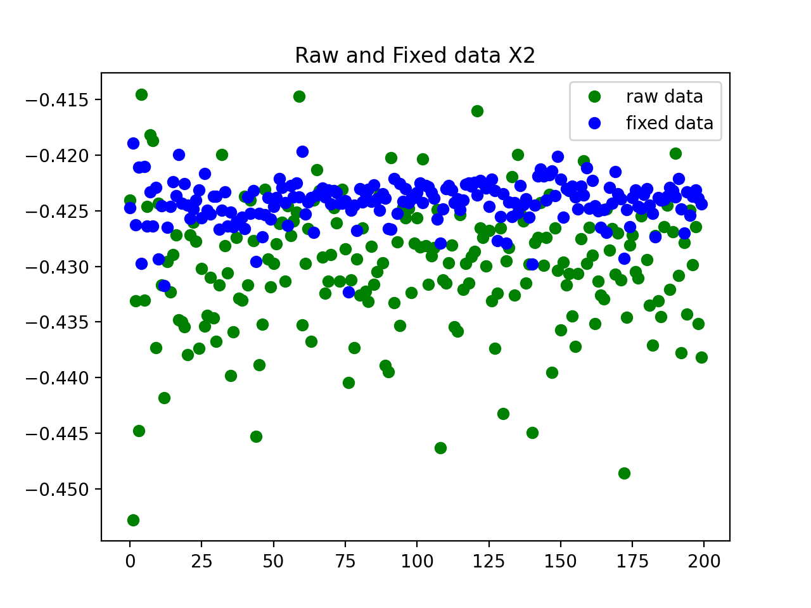

<figcaption>Исходные данные выборка <em>X</em>2</figcaption>
</figure>

Гистограмма распеределения $\delta_i$ для $X_2$ имеет вид.

<figure id="p:deltasHistX2">

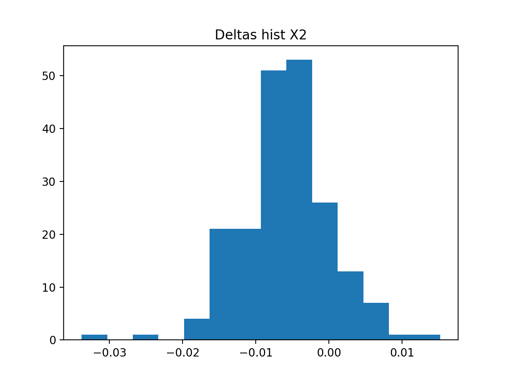

<figcaption>Гистограмма распределения <em>δ</em><em>i</em> для <em>X</em>2</figcaption>
</figure>

На рис. [1](#p:rawSampleX1){reference-type="ref"
reference="p:rawSampleX1"}, [3](#p:rawSampleX2){reference-type="ref"
reference="p:rawSampleX2"} видно, что учёт $\delta_i$ значительно
уменьшил разброс исходных данных.

Теперь посмотрим на построенные интервальные выборки $X_1, X_2$.

<figure id="p:x1">

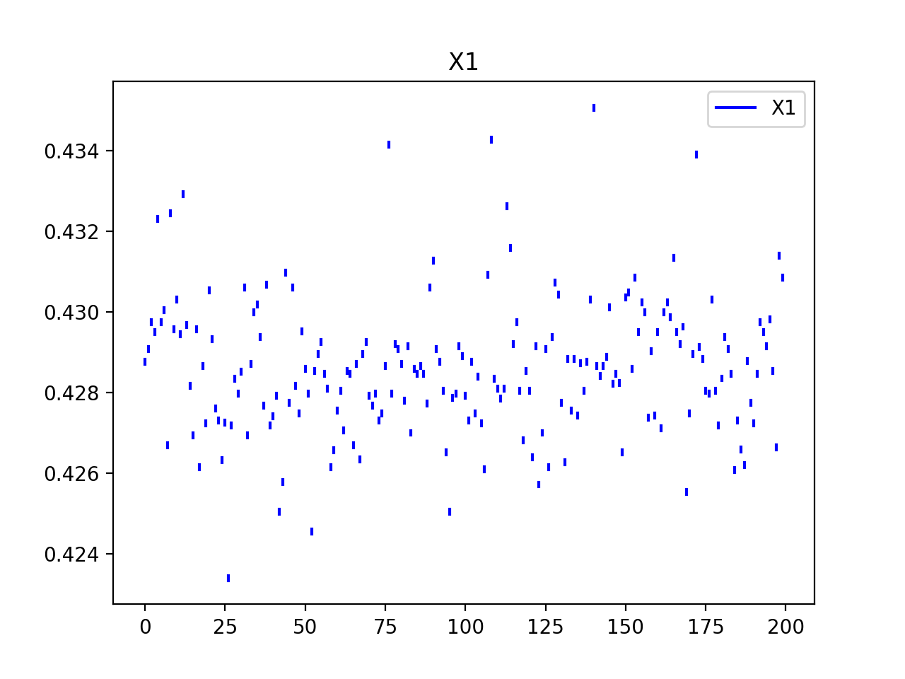

<figcaption>Интервальная выборка <em>X</em>1</figcaption>
</figure>

<figure id="p:x2">

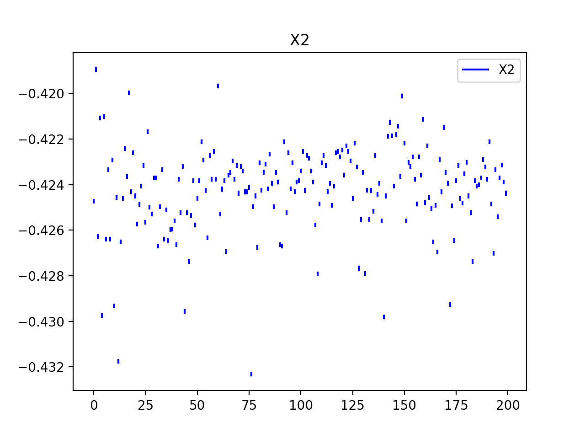

<figcaption>Интервальная выборка <em>X</em>2</figcaption>
</figure>

Также построим график частоты пересечений подинтервалов для построения
моды с исходными интервалами выборок. Сначала для $X_1$.

<figure id="p:modaX1">

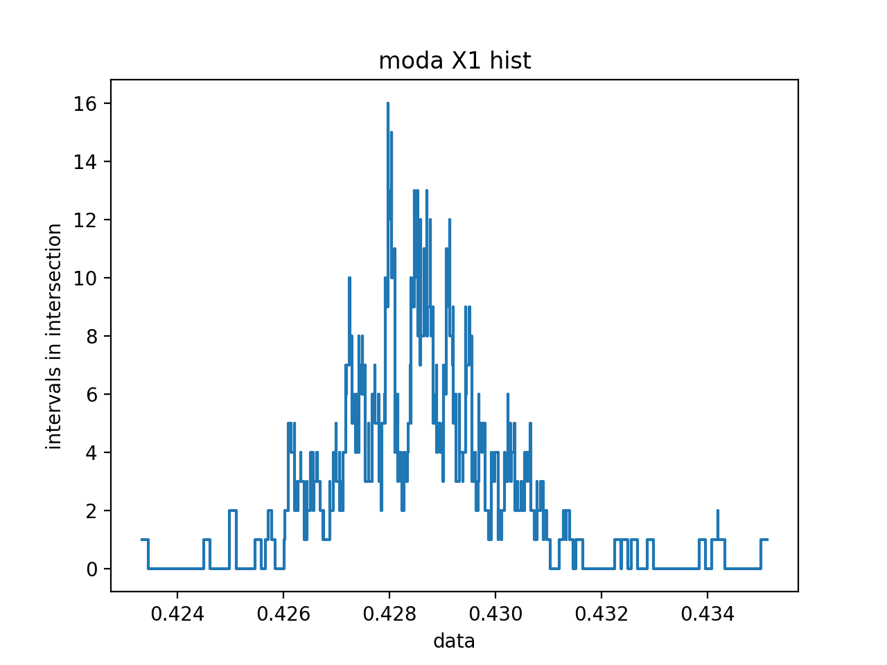

<figcaption>Частота пересечений подинтервалов с интервалами выборки
<em>X</em>1</figcaption>
</figure>

Затем для $X_2$.

<figure id="p:modaX2">

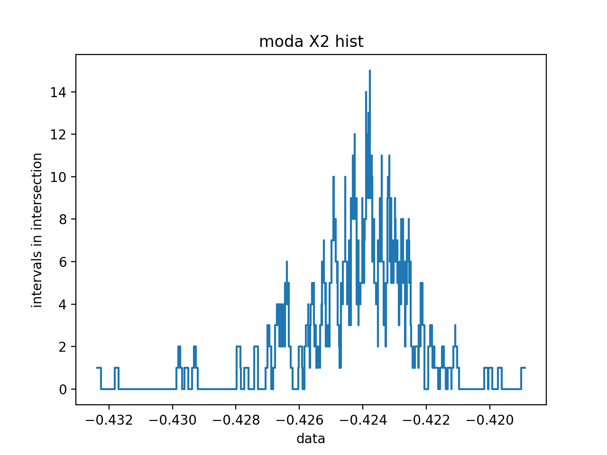

<figcaption>Частота пересечений подинтервалов с интервалами выборки
<em>X</em>2</figcaption>
</figure>

Мода для выборки $X_1$ равна интервалу
$\mu_{X_1} = [0.427979, 0.427981]$, для выборки $X_2$ мода равно
интервалу $\mu_{X_2} = [-0.423771, -0.423769]$.

Посчитаем индекс Жаккара обеих выборок. $JK(X_1) = 0.01036$,
$JK(X_2) = 0.00905$. Найдем оптимальное значение $R$ (для наглядности на
графике [9](#p:jaccard){reference-type="ref" reference="p:jaccard"}
изображён более широкий интервал значений $R$).

<figure id="p:jaccard">

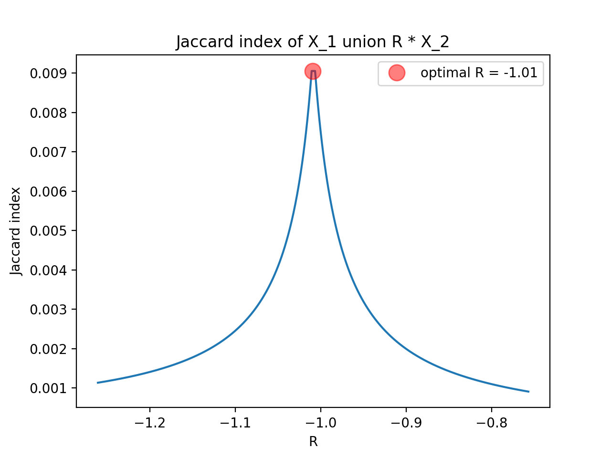

<figcaption>Зависимость индекса Жаккара от значения <em>R</em></figcaption>
</figure>

Оптимальное значение $R$ оказалось равно $R_{opt} = -1.0095$ Построим
объединённую выборку $X = X_1 \cup R_{opt} X_2$.

<figure id="p:x1rx2">

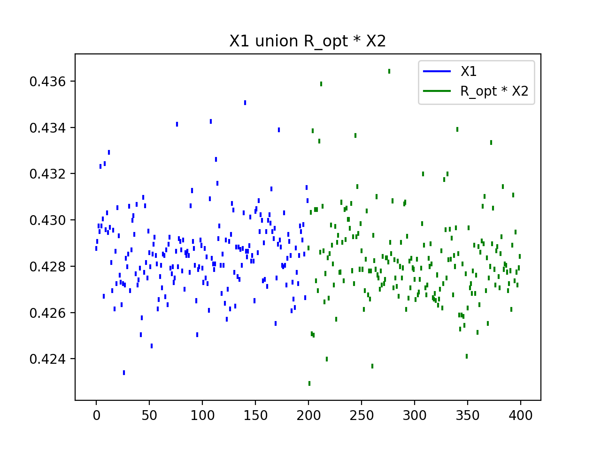

<figcaption>Объединённая выборка <em>X</em>1 ∪ <em>R</em><em>o</em><em>p</em><em>t</em><em>X</em>2</figcaption>
</figure>

Индекс Жаккара полученной выборки равен $JK(X) = 0.00905$.

Построим график частоты пересечений подинтервалов с объединённой
выборкой $X_1 \cup R_{opt} X_2$.

<figure id="p:moadX2RX2">

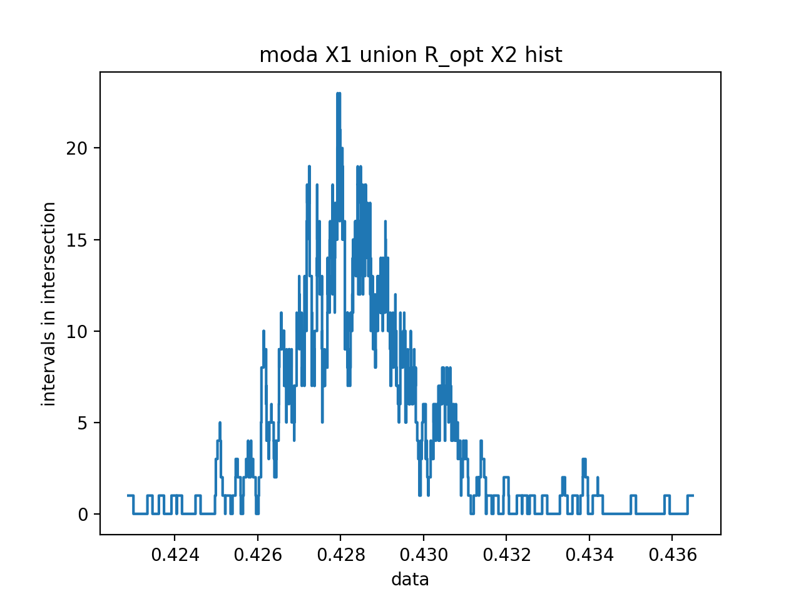

<figcaption>Частота пересечений подинтервалов с интервалами выборки
<em>X</em>1 ∪ <em>R</em><em>o</em><em>p</em><em>t</em><em>X</em>2</figcaption>
</figure>

Мода для объединённой выборки $X_1 \cup R_{opt} X_2$ равна интервалу
$\mu_{X_1 \cup R_{opt} X_2} =  [0.427926, 0.427928]$.

Посмотрим на зависимость частоты пересечений моды $\mu(R)$ с интервалами
для объединённой выборки $X_1 \cup R X_2$ в зависимости от значений $R$.

<figure id="p:modaR">

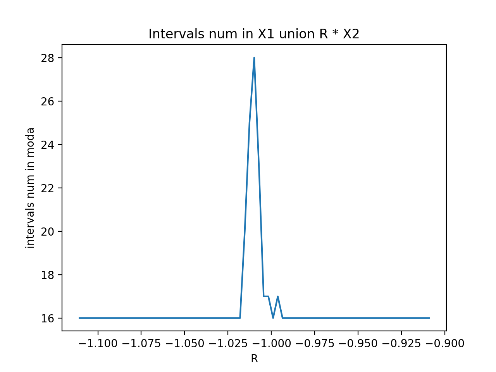

<figcaption>Зависимость частоты пересечения моды с интервалами <em>X</em>1 ∪ <em>R</em><em>X</em>2</figcaption>
</figure>

Найдём внутреннюю оценку $\textbf{R}$ двумя способами: используя индекс
Жаккара и моду. Для этого введём уровень доверия $\alpha = 0.95$ и
найдем крайние значений $R$, удовлетворяющие
$JK(R) > JK(R_{opt}) * \alpha$ в случае индекса Жаккара и
$\mu(R) > \mu(R_{opt}) * \alpha$ в случае моды. Результаты представлены
на рис. [13](#p:InnerOuter){reference-type="ref"
reference="p:InnerOuter"} (график $\mu(R)$ нормирован так, чтобы
$\max_R{\mu(R)}$ и $\max_R{JK(R)}$ были равны).

<figure id="p:InnerOuter">

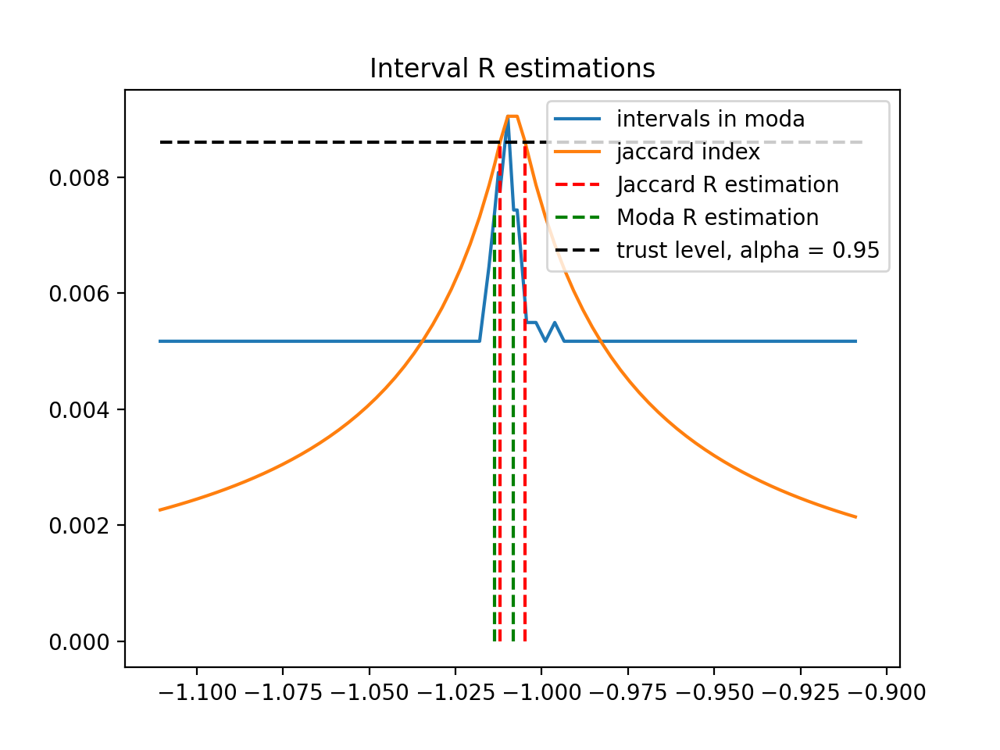

<figcaption>Внутренняя и внешняя оценки <em>R</em></figcaption>
</figure>

В итоге получили следующие оценки: $R_{JK} = [-1.012119, -1.004806]$,
$R_{\mu} = [-1.01361, -1.008163]$.

Внешнюю оценку получим по формулам
[\[e:outerRMin\]](#e:outerRMin){reference-type="ref"
reference="e:outerRMin"},
[\[e:outerRMax\]](#e:outerRMax){reference-type="ref"
reference="e:outerRMax"} $R_{out} = [-1.01062, -1.006362]$.

Сравним полученные результаты с теми, что будут без учёта $\delta_i$.
$X'_k = \{[x_i - \varepsilon, x_i + \varepsilon]\}^n_{i=1}, k = 1,2$.

$X'_1$ имеют вид.

<figure id="p:werrX1">

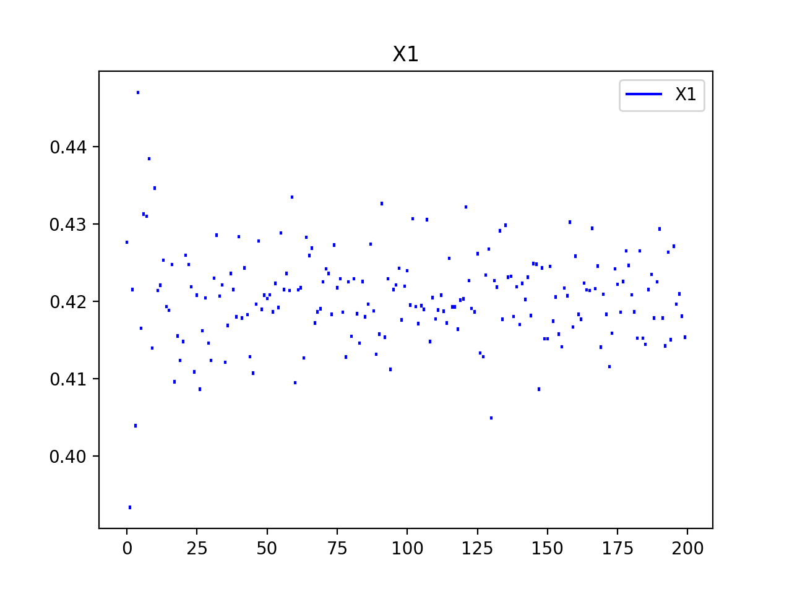

<figcaption>Интервальная выборка <em>X</em>′1</figcaption>
</figure>

<figure id="p:werrX2">

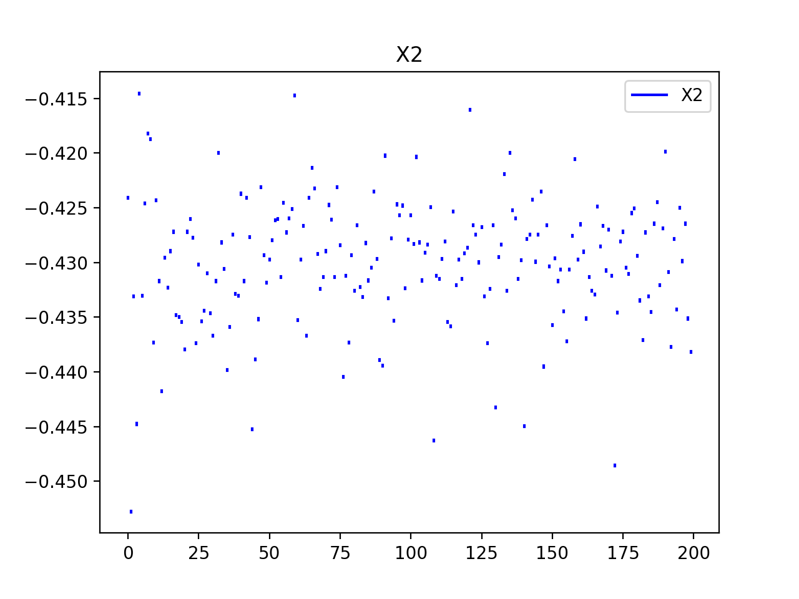

<figcaption>Интервальная выборка <em>X</em>′2</figcaption>
</figure>

Вычислим индекс Жаккара $JK(X'_1) = 0.00227, JK(X'_2) = 0.00318$.

Зависимость индекса Жаккара от значения параметра $R$ имеет вид.

<figure id="p:werrJaccard">

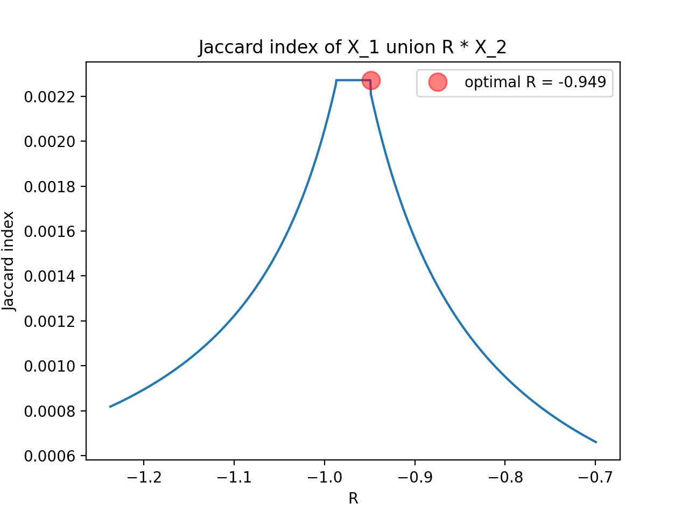

<figcaption>Зависимость индекса Жаккара от значения <em>R</em></figcaption>
</figure>

Также построим зависимость числа интервалов в моде от параметра $R$.

<figure id="p:werrModa">

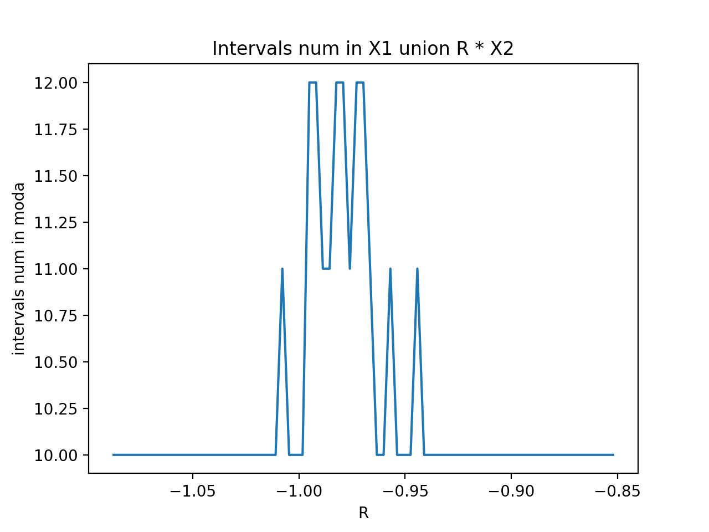

<figcaption>Зависимость числа интервалов в моде от <em>R</em></figcaption>
</figure>

Видно, что оптимальное значение параметра $R$ равно
$R'_{opt} = -0.94892$, что значительно отличается от первого случая.
Тогда объелинённая выборка $X'_1 \cup R'_{opt} X'_2$ имеет вид.

<figure id="p:werrX1RX2">

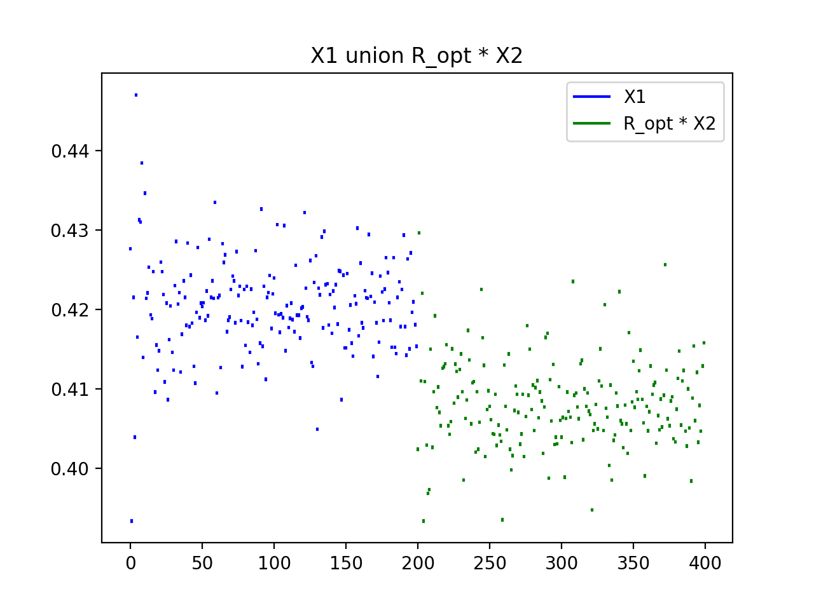

<figcaption>Объединённая выборка <em>X</em>′1 ∪ <em>R</em>′<em>o</em><em>p</em><em>t</em><em>X</em>′2</figcaption>
</figure>

# Обсуждение

Из полученных результатов можно заметить следующее. Как видно на рисунке
[9](#p:jaccard){reference-type="ref" reference="p:jaccard"} график
значений индекса Жаккара в зависимости от параметра $R$ имеет один
локальный минимум. Также видно, что индекс Жаккара объединённой выборки
$X = X_1 \cup R X_2$ для любого значения $R$ не превосходит значения
индексов Жаккара для каждой выборки $X_1, X_2$ по отдельности, что
вполне ожидаемо. Несмотря на это, $JK(X)$ не сильно отличается от
значений $JK(X_1), JK(X_2)$, скорее всего это связано с тем, что
интервалы из $X_1$ и $R X_2$ имеют примерно одинаковую длину, что видно
на рисунке [10](#p:x1rx2){reference-type="ref" reference="p:x1rx2"}.
