::: titlepage
::: center
Санкт-Петербургский политехнический университет\
Петра Великого\
:::

::: center
Физико-механический иститут
:::

::: center
Кафедра «Прикладная математика»
:::

::: center
**Отчёт по лабораторной работе №2\
по дисциплине «Анализ данных с интервальной неопределённостью»**
:::

::: flushleft
Выполнил студент:\
Аникин Александр Алексеевич\
группа: 5040102/20201

Проверил:\
к.ф.-м.н., доцент\
Баженов Александр Николаевич
:::

::: center
Санкт-Петербург\
2023 г.
:::
:::

# Постановка задачи

# Теория

## Точечная линейная регрессия

Рассматривается задача восстановления зависимости для выборки
$(X, \textbf(Y))$,
$X = \{x_i\}_{i=1}^{n}, \textbf{Y} = \{\textbf{y}_i\}_{i=1}^{n}$,
$x_i$ - точеный, $\textbf{y}_i$ - интервальный. Пусть искомая модель
задана в классе линейных функций

[]{#e:model label="e:model"} $$y = \beta_0 + \beta_1 x$$

Поставим задачу оптимизацию [\[e:task\]](#e:task){reference-type="ref"
reference="e:task"} для нахождения точечных оценок параметров
$\beta_0, \beta_1$.

[]{#e:task label="e:task"} $$\begin{gathered}
            \sum_{i = 1}^{m}w_{i} \to \min \\
            \text{mid}\textbf{y}_{i} - w_{i} \cdot \text{rad}\textbf{y}_{i} \leq X\beta \leq \text{mid}\textbf{y}_{i} + w_{i} \cdot \text{rad}\textbf{y}_{i} \\
            w_{i} \geq 0, i = 1, ..., m \\
            w, \beta - ?
        \end{gathered}$$

Задачу [\[e:task\]](#e:task){reference-type="ref" reference="e:task"}
можно решить методами линейного программирования.

## Информационное множество

*Информационным множеством* задачи восстановления зависимости будем
называть множество значений всех параметров зависимости, совместных с
данными в каком-то смысле.

*Коридором совместных зависимостей* задачи восстановления зависимости
называется многозначное множество отображений $\Upsilon$, сопоставляющее
каждому значению аргумента $x$ множество

$$\Upsilon(x) = \bigcup_{\beta \in \Omega} f(x, \beta)$$

, где $\Omega$ - информационное множество, $x$ - вектор переменных,
$\beta$ - вектор оцениваемых параметров.

Информационное множество может быть построено, как пересечение полос,
заданных

$$\underline{\textbf{y}_i} \leq \beta_0 + \beta_1 x_{i1} + ... + \beta_m x_{im} \leq \overline{\textbf{y}_i}$$
, где $i = \overline{1, n} \textbf{y}_i \in \textbf{Y}, x_i \in X$,
$X$ - точечная выборка переменных, $\textbf{Y}$ - интервальная выборка
откликов.

# Результаты

Данные $S_X$ были взяты из файлов *data/dataset1/X/X_0.txt*, где
$X \in \{-0\_5, -0\_25, +0\_25, +0\_5 \}$. Набор $\delta_i$ получен из
соответствующих файлов в *data/dataset1/ZeroLine.txt*.

Набор значений $X$ точечный и одинаков для всех выборок.
$X = [-0.5, -0.25, 0.25, 0.5]$. Набор значений отклика $Y$ интервальный
и разный для каждой выборки.

Построим линейную регрессию и найдём информационное множество для
нескольких выборок.

Рассмотрим первую выборку $Y_1$. $Y_1$ следующим образом.
$y_i = [\min_{t \in S_i}{S_i}, \max_{t \in S_i}{S_i}]$,
$i = [-0.5, -0.25, +0.25, +0.25], y_i \in Y_1$.

<figure id="p:sampleY1">

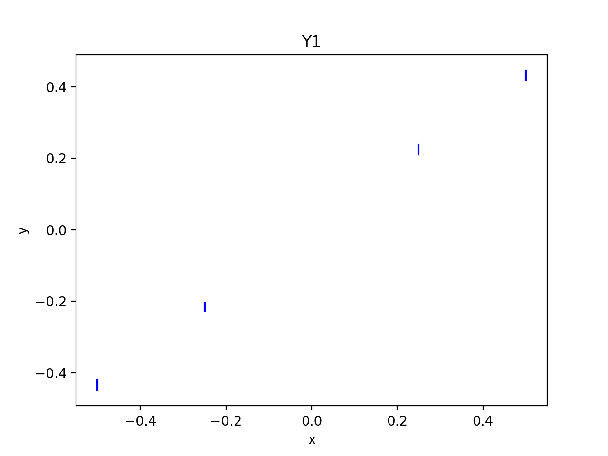

<figcaption>Первая выборка, <em>Y</em>1</figcaption>
</figure>

Построим линейную регрессию, решив задачу
[\[e:task\]](#e:task){reference-type="ref" reference="e:task"} для
выборки $Y_1$.

<figure id="p:regressionY1">

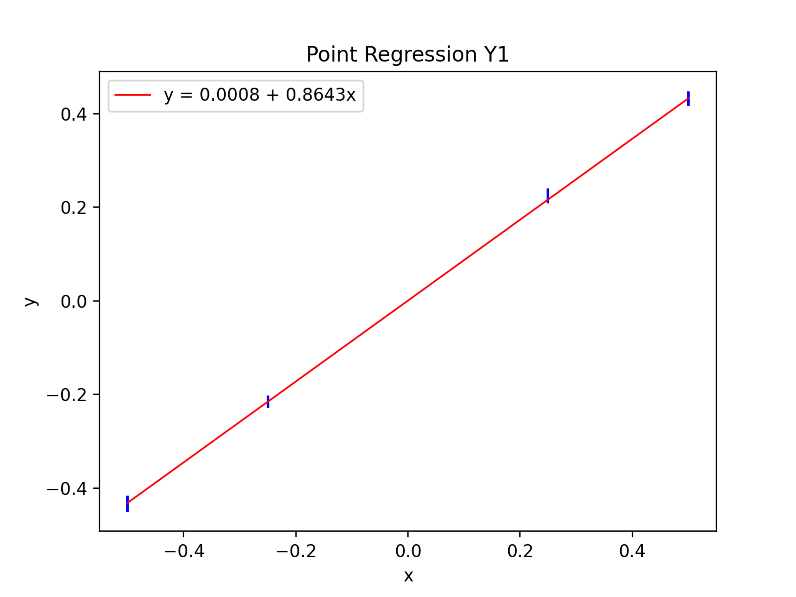

<figcaption>Точечная линейная регрессия для <em>Y</em>1</figcaption>
</figure>

Получим следующие оценки для параметров:
$\beta_0 = 0.00076, \beta_1 = 0.86426$. Тогда полученная модель имеет
вид $y = 0.00076 + 0.86426 x$.

Найдём для данной выборки информационное множество.

<figure id="p:informSetY1">

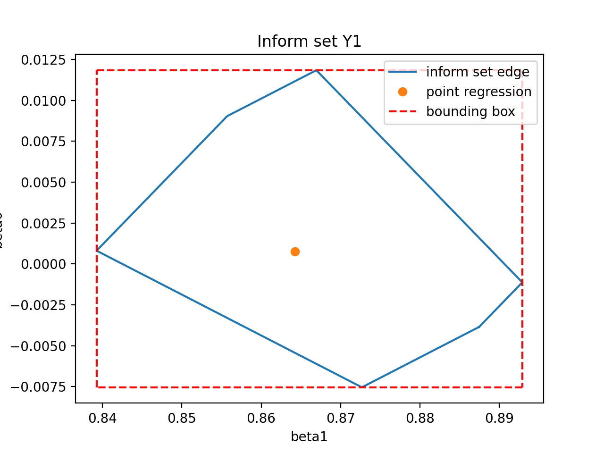

<figcaption>Информационное множество для <em>Y</em>1</figcaption>
</figure>

На рис. [3](#p:informSetY1){reference-type="ref"
reference="p:informSetY1"} можно заметит, что найденные параметры
$\beta_0, \beta_1$ решением задачи
[\[e:task\]](#e:task){reference-type="ref" reference="e:task"} лежат
внутри информационного множества.

Построим коридор совместных значений для выборки $Y_1$ и информационного
множества [3](#p:informSetY1){reference-type="ref"
reference="p:informSetY1"} и оценим значения выходной переменной $y$ вне
пределов значений входной переменной $x$.

<figure id="p:informSetCorridorY1">

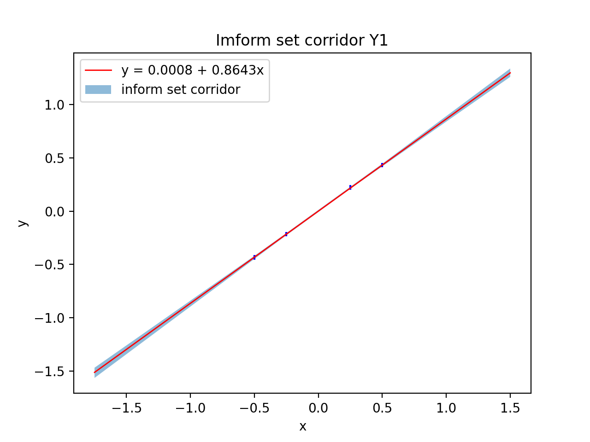

<figcaption>Коридор совместных значений для <em>Y</em>1</figcaption>
</figure>

На рис. [4](#p:informSetCorridorY1){reference-type="ref"
reference="p:informSetCorridorY1"} видно, что построенная точечная
регрессия лежит внутри коридора совместных значений, что согласуется с
рис. [3](#p:informSetY1){reference-type="ref"
reference="p:informSetY1"}.

Проведём аналогичные построения для выборки $Y_2$, построенную следующим
образом. $y_i = [median(S_i) - \varepsilon, median(S_i) + \varepsilon]$,
$\varepsilon = \frac{1}{2^{14}}$
$i = [-0.5, -0.25, +0.25, +0.25], y_i \in Y_2$. $Y_2$ имеет вид.

<figure id="p:sampleY2">

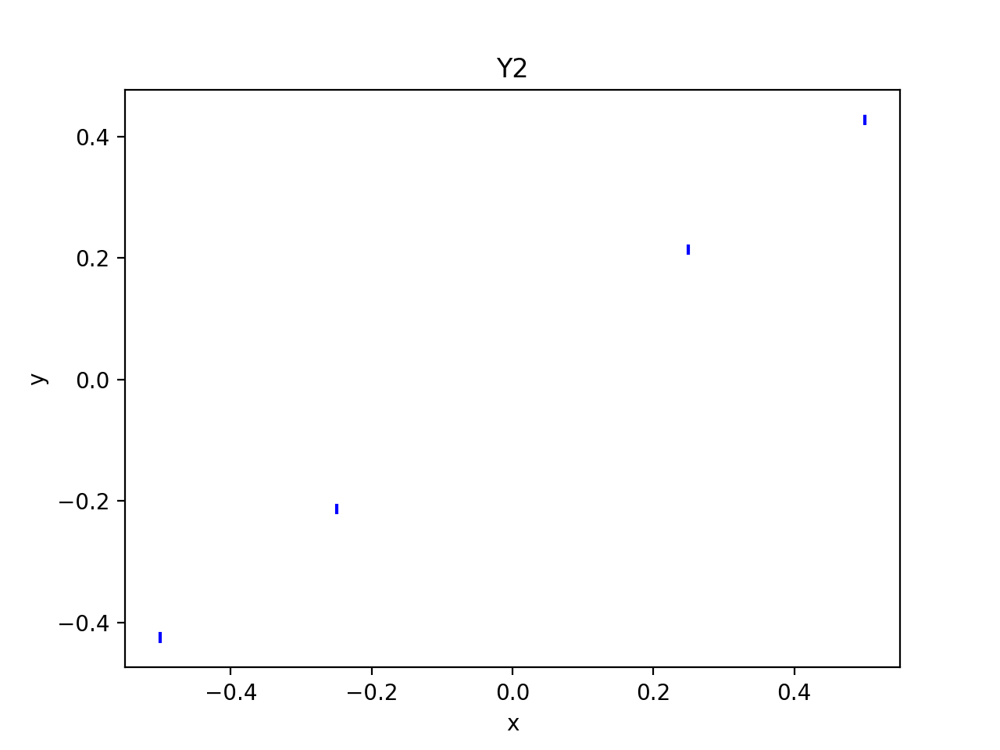

<figcaption>Вторая выборка, <em>Y</em>2</figcaption>
</figure>

Построим точечную линейную регрессию для $Y_2$.

<figure id="p:regressionY2">

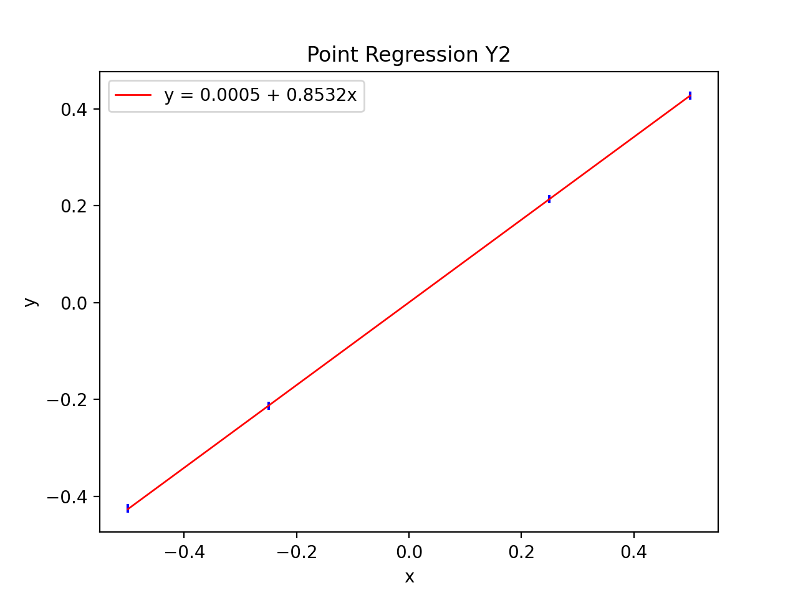

<figcaption>Точечная линейная регрессия для <em>Y</em>2</figcaption>
</figure>

Для $Y_2$ получили следующие оценки параметров:
$\beta_0 = 0.0005, \beta_1 = 0.85324$. Построим информационное множество
и коридор совместных значений для $Y_2$.

<figure id="p:informSetY2">

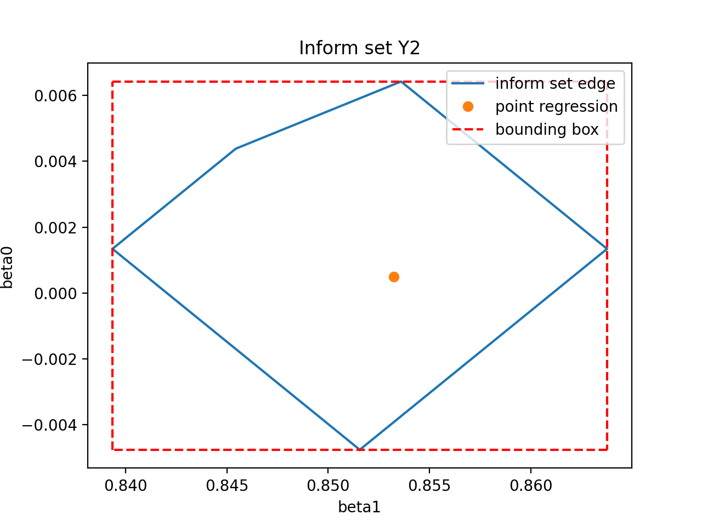

<figcaption>Информационное множество для <em>Y</em>2</figcaption>
</figure>

<figure id="p:informSetCorridorY2">

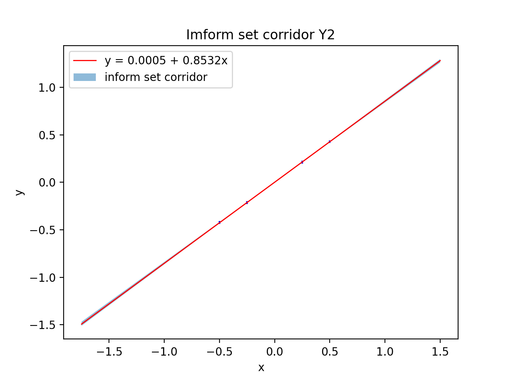

<figcaption>Коридор совместных значений для <em>Y</em>2</figcaption>
</figure>

В итоге для $Y_2$ получили, что точечная регрессия также попала в
информационное множество.

Теперь проведём аналогичные построения для $Y_3$, построенную аналогично
$Y_1$, за исключением отсутствия учёта $\delta_i$. $Y_3$ имеет вид.

<figure id="p:sampleY3">

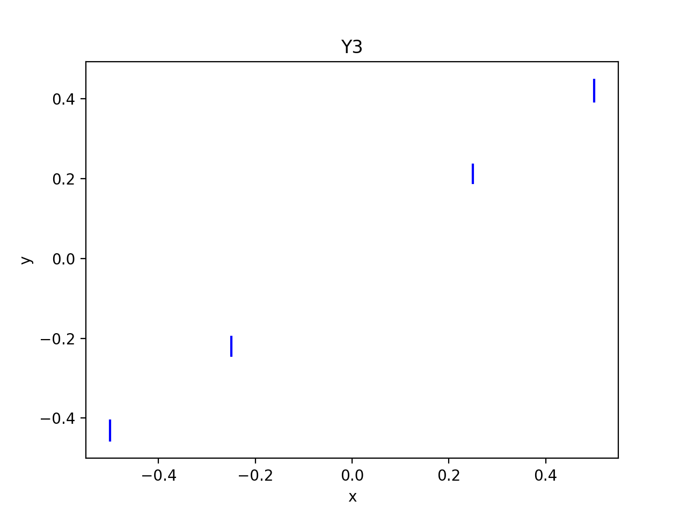

<figcaption>Третья выборка, <em>Y</em>3</figcaption>
</figure>

Построим точечную регрессию.

<figure id="p:regressionY3">

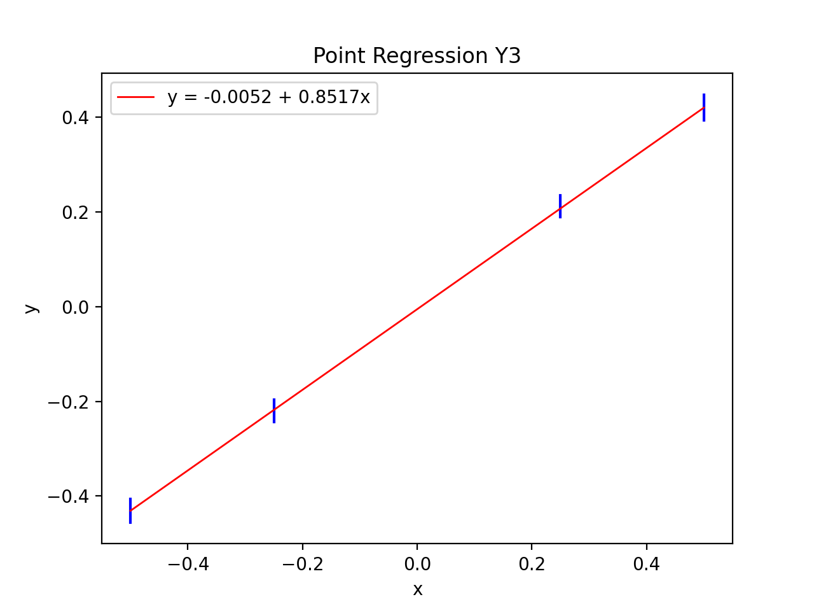

<figcaption>Точечная линейная регрессия для <em>Y</em>3</figcaption>
</figure>

Для $Y_3$ точечная линейная регрессия дала следующие оценки:
$\beta_0 = -0.0052, \beta_1 = 0.85169$. Информационное множество и
коридор совместных значений имеют следующий вид.

<figure id="p:informSetY3">

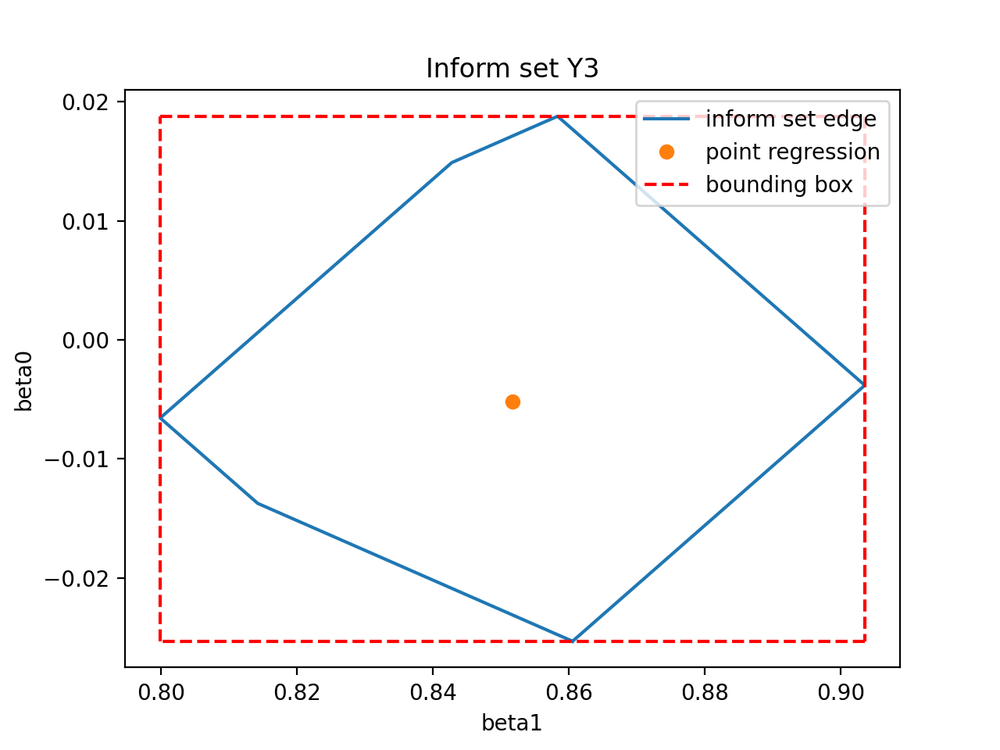

<figcaption>Информационное множество для <em>Y</em>3</figcaption>
</figure>

<figure id="p:informSetCorridorY3">

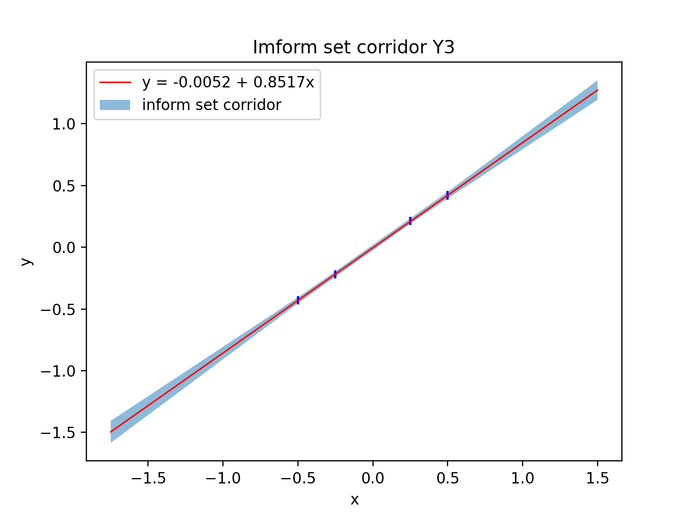

<figcaption>Коридор совместных значений для <em>Y</em>3</figcaption>
</figure>

# Обсуждение

Из полученных результатов можно заметить следующее. Наиболее маленькое
информационное множество было получено для выборки $Y_2$, что
неудивительно, так как $Y_2$ имеет наименьшую интервальную
неопределённость. Соответственно для $Y_2$ получили и наиболее узкий
коридор совместных значений.

     0     $\beta_0$   $\beta_1$
  ------- ----------- -----------
   $Y_1$   $0.00076$   $0.86426$
   $Y_2$   $0.0005$    $0.85324$
   $Y_3$   $-0.0052$   $0.85169$

Видно, что для выборок $Y_1, Y_2$ точечная линейная регрессия дала более
точный результат, близкий к ожидаемому $\beta_0 = 0.0, \beta_1 = 1.0$.
Для $Y_3$ получили более неточную оценку, так оценка параметра $\beta_0$
для $Y_3$ отличается на порядок от соответствующей оценки для
$Y_1, Y_2$.

Также стоит отметить, что во всех случаях точечная линейная регрессия
попала в информационное множество.
