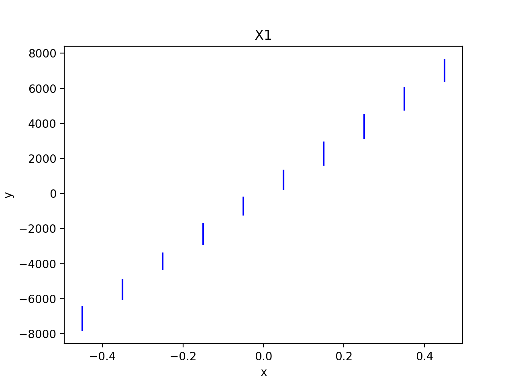
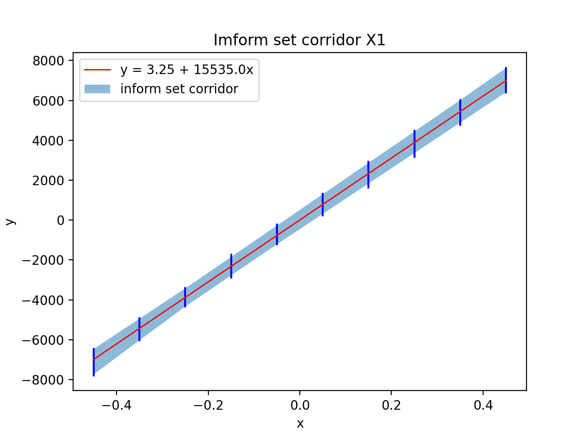
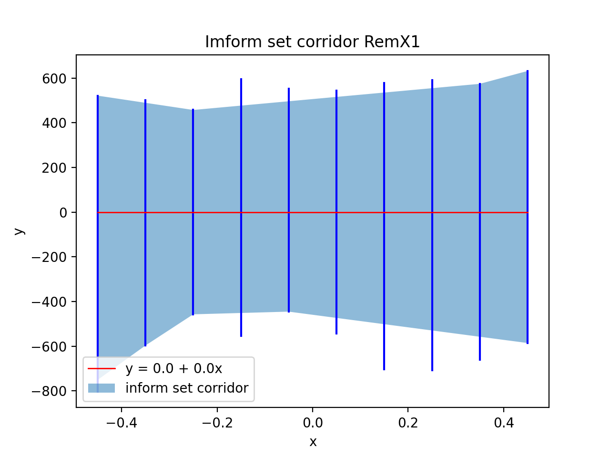
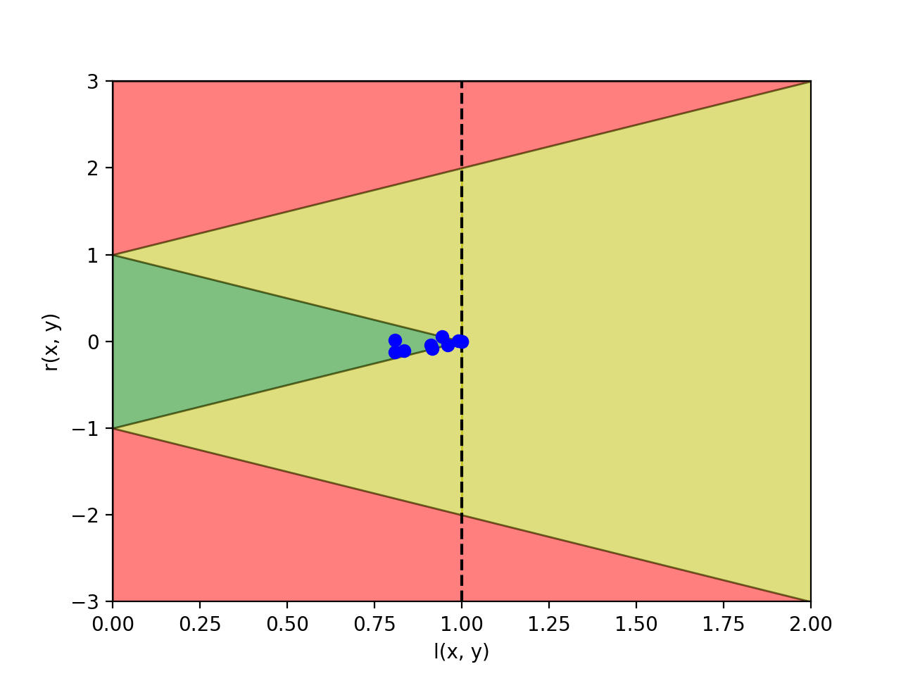
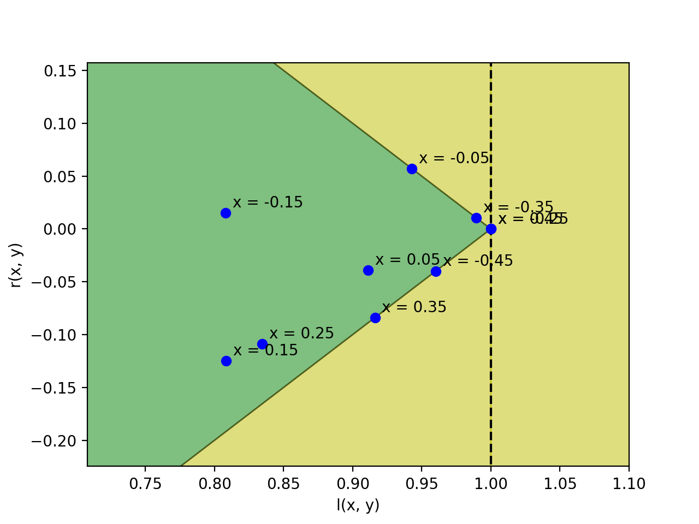
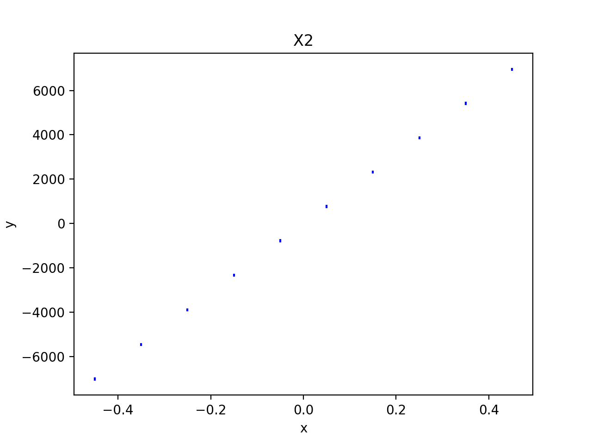
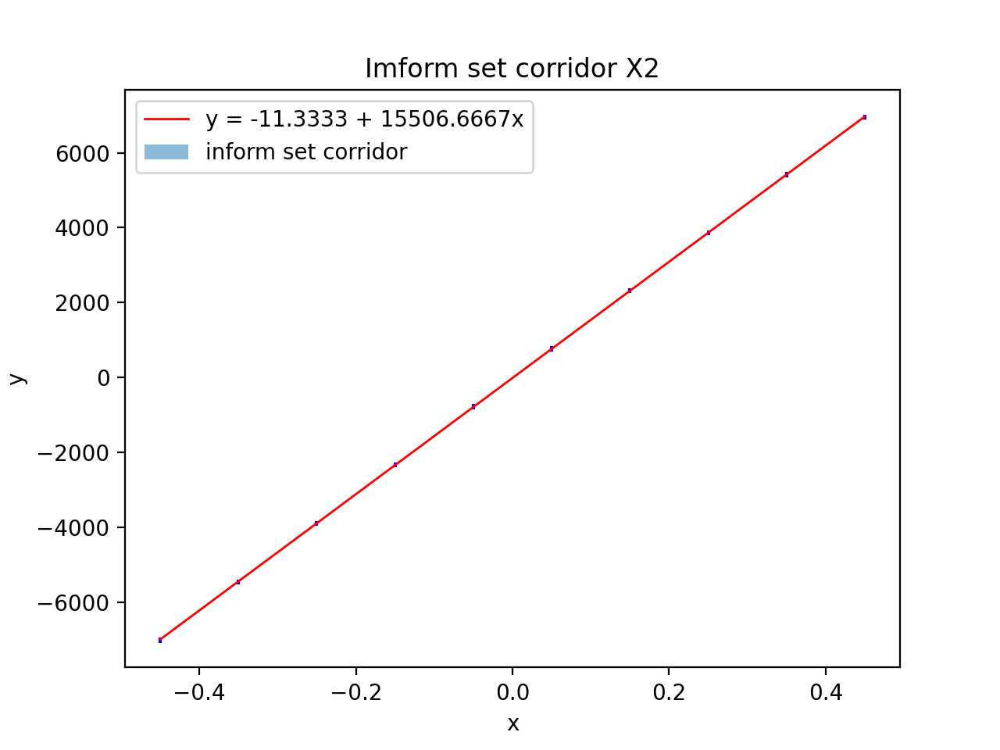
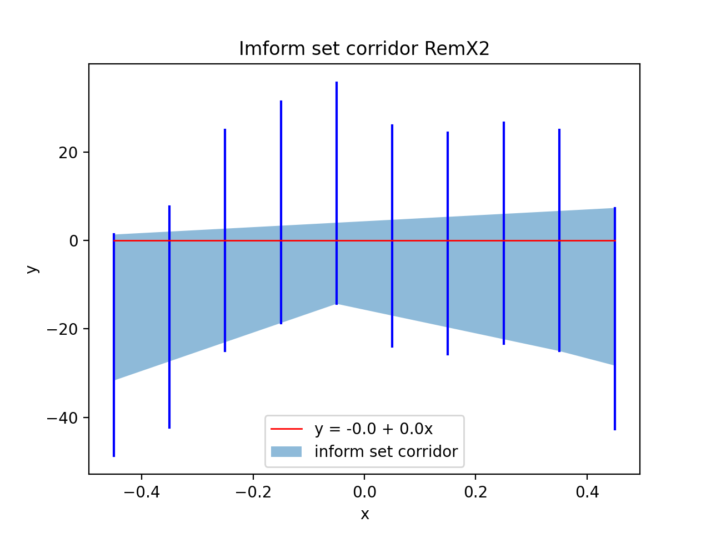
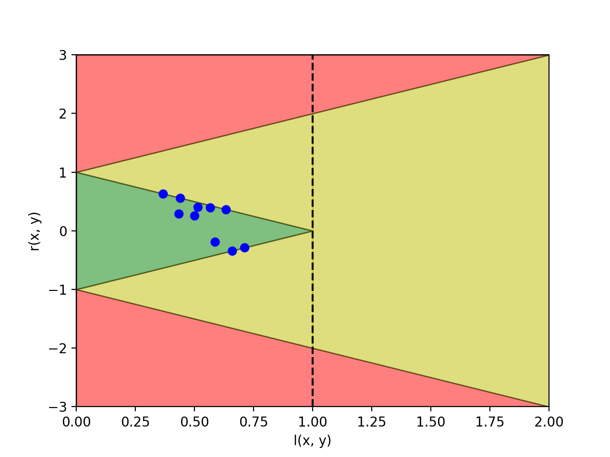
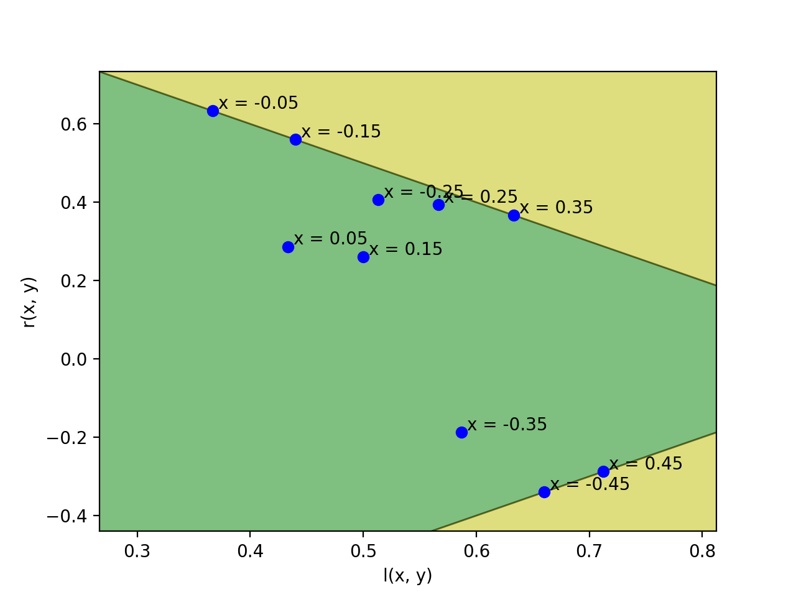

::: titlepage
::: center
Санкт-Петербургский политехнический университет\
Петра Великого\
:::

::: center
Физико-механический иститут
:::

::: center
Кафедра «Прикладная математика»
:::

::: center
**Отчёт по лабораторной работе №3\
по дисциплине «Анализ данных с интервальной неопределённостью»**
:::

::: flushleft
Выполнил студент:\
Аникин Александр Алексеевич\
группа: 5040102/20201

Проверил:\
к.ф.-м.н., доцент\
Баженов Александр Николаевич
:::

::: center
Санкт-Петербург\
2023 г.
:::
:::

# Постановка задачи

Провести анализ остатков интервальных измерений.

# Теория

## Классификация измерений

Измерения можно классифицировать следующим образом. Измерения,
добавление которых к выборке не приводит к модификации модели,
называются *внутренними*. Те, которые изменяют модель, называются
*внешними*. Измерения, которые определяют какую-либо границу
информационного множества, называются *граничными*. *Выбросами*
называются те измерения, которые делают информационное множество пустым.
Граничные измерения - подмножество внутренних, выбросы - внешних.

Для удобства анализа взаимоотношения информационных множеств работу с
ними заменяют на анализ взаимоотношения интересующего интервального
измерения и интервального прогнозируемого значения модели (коридора
совместных значений).

## Взаимные отношения интервалов наблюдения и прогнозного интервала модели

Существует несколько характеристик, определяющих это взаимоотношение.

*Размахом (плечом)* называется следующее отношение
[\[e:leverage\]](#e:leverage){reference-type="ref"
reference="e:leverage"}.

[]{#e:leverage label="e:leverage"}
$$l(x, \textbf{y}) = \frac{\Upsilon(x)}{rad(\textbf{y})}$$

*Относительным остатком* называется отношение
[\[e:residual\]](#e:residual){reference-type="ref"
reference="e:residual"}.

[]{#e:residual label="e:residual"}
$$r(x, \textbf{y}) = \frac{mid(\textbf{y}) - mid(\Upsilon(x))}{rad(\textbf{y})}$$
здесь $x$ - точечное значение, $\textbf{y}$ - интервальное значение
интересующей величины (отклик $x$), $\Upsilon(x)$ - интервальная оценка
интересующей величины (значение коридора совместных значений).

Для внутренних наблюдений выполняется неравенство
[\[e:inner\]](#e:inner){reference-type="ref" reference="e:inner"}.

[]{#e:inner label="e:inner"}
$$|r(x, \textbf{y})| \leq 1 - l(x, \textbf(y))$$

В случае равенства [\[e:inner\]](#e:inner){reference-type="ref"
reference="e:inner"} измерение будет граничным.

Выбросы определяются неравенством
[\[e:remainder\]](#e:remainder){reference-type="ref"
reference="e:remainder"}

[]{#e:remainder label="e:remainder"}
$$|r(x, \textbf{y})| > 1 + l(x, \textbf{y})$$

# Результаты

Данные $S_X$ были взяты из файлов *data/dataset2/XV_spN.txt*, где
$X \in P = \{-0.45, -0.35, -0.25, -0.15, -0.05, 0.05, 0.15, 0.25, 0.35, 0.45 \}$.
Набор $\delta_i$ получен из файла *data/dataset2/0.0V_sp443.txt*.

Рассмотрим первую выборку $Y_1$. $Y_1$ получена следующим образом.
$\textbf{y}_i = [\min{S_i}, \max{S_i}]$, $i \in P$,
$\textbf{y}_i \in Y_1$.

<figure id="p:sampleX1">

<figcaption>Первая выборка, <em>Y</em>1</figcaption>
</figure>

Построим точечную линейную регрессию и коридор совместных значений.

<figure id="p:informSetCorridorX1">

<figcaption>Точечная линейная регрессия и коридор совместных значений
для <em>Y</em>1</figcaption>
</figure>

Построим выборку остатков $\mathcal{E}_1$,
$\varepsilon_i = \textbf{y}_i - (\beta_0 + \beta_1 x_i)$,
$\varepsilon_i \in \mathcal{E}_1$.

Выборка $\mathcal{E}_1$ и коридор совместных значений для
$\mathcal{E}_1$ имеют вид.

<figure id="p:informSetCorridorRemX1">

<figcaption>Точечная линейная регрессия и коридор совместных значений
для ℰ1</figcaption>
</figure>

Теперь построим диаграмму статусов для выборки $\mathcal{E}_1$. По оси
$x$ лежит значение размаха (см.
[\[e:leverage\]](#e:leverage){reference-type="ref"
reference="e:leverage"}), по оси $y$ значение относительного остатка
(см. [\[e:residual\]](#e:residual){reference-type="ref"
reference="e:residual"}).

<figure id="p:diagramStatusX1">

<figcaption>Диаграмма статусов измерений выборки ℰ1</figcaption>
</figure>

Для данной выборки $\mathcal{E}_1$ и простейшей линейной модели
граничными являются измерения, соответствующие следующим значениям
переменной $x$: $[-0.45, -0.35, -0.25, -0.05, 0.35]$. Измерение,
соответствующее переменной $x = 0.45$, возможно, является внешним или
также граничным, а все остальные измерения внутренние (рис.
[5](#p:diagramStatusZoomX1){reference-type="ref"
reference="p:diagramStatusZoomX1"}).

<figure id="p:diagramStatusZoomX1">

<figcaption>Диаграмма статусов измерений выборки ℰ1 (Приближеие)</figcaption>
</figure>

Для наглядности проведём аналогичные измерения для другой выборки $Y_2$.
$Y_2$ получена следующим образом.
$\textbf{y}_i = [median(S_i) - \varepsilon, median(S_i) + \varepsilon]$,
$\varepsilon = 25.0$, $i \in P$, $\textbf{y}_i \in Y_2$.

$Y_2$ имеет вид.

<figure id="p:sampleX2">

<figcaption>Вторая выборка, <em>Y</em>2</figcaption>
</figure>

Построим точечную линейную регрессию и коридор совместных значений для
$Y_2$.

<figure id="p:informSetCorridorX2">

<figcaption>Точечная линейная регрессия и коридор совместных значений
для <em>Y</em>2</figcaption>
</figure>

Выборка остатков $\mathcal{E}_2$ и коридор совместных значений для
$\mathcal{E}_2$ имеют вид.

<figure id="p:informSetCorridorRemX2">

<figcaption>Точечная линейная регрессия и коридор совместных значений
для ℰ2</figcaption>
</figure>

Построим диаграмму статусов для $\mathcal{E}_2$.

<figure id="p:diagramStatusX2">

<figcaption>Диаграмма статусов измерений выборки ℰ2</figcaption>
</figure>

Для выборки $\mathcal{E}_2$ граничными являются измерения,
соответствующие значениям переменной
$x \in [-0.45, -0.15, -0.05, 0.35, 0.45]$. Остальные являются
внутренними.

<figure id="p:diagramStatusZoomX2">

<figcaption>Диаграмма статусов измерений выборки ℰ2 (Приближение)</figcaption>
</figure>

# Обсуждение

Из полученных результатов можно заметить следующее. Для первой выборки
на диаграмме статутов измерений статусы находятся вблизи точки $(1, 0)$
(рис. [4](#p:diagramStatusX1){reference-type="ref"
reference="p:diagramStatusX1"}), в то время как для второй выборки
статусы расположились дальше от точки $(1, 0)$, имеют меньшие значения
для плеча (см. [\[e:leverage\]](#e:leverage){reference-type="ref"
reference="e:leverage"}) и большие по модулю для относительного остатка
(см. [\[e:residual\]](#e:residual){reference-type="ref"
reference="e:residual"}). Это вполне сочетается с тем, как выглядят
коридоры совместных значений для каждой выборки (рис.
[3](#p:informSetCorridorRemX1){reference-type="ref"
reference="p:informSetCorridorRemX1"},
[8](#p:informSetCorridorRemX2){reference-type="ref"
reference="p:informSetCorridorRemX2"}). Также стоит отметить, что ни для
одной выборки не было обнаружено выбросов или явных внешних измерений.
